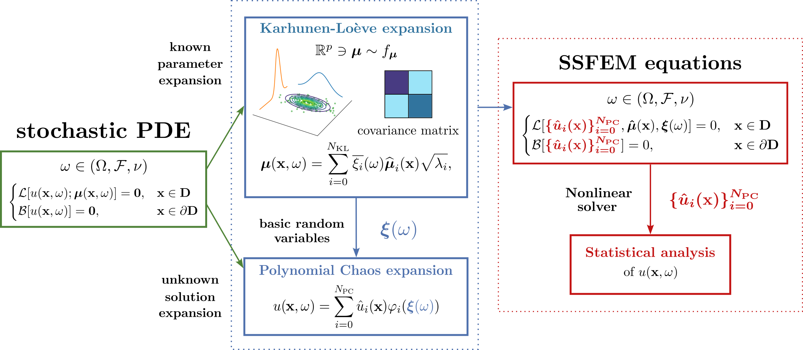

# SSFEM for Coanda-Effect

Implementation of the SSFEM pipeline relying on the __Deal-II__ C++ library (9.7.1) tested for the Coanda Effect, a benchmark in Fluid Dynamics explained in [_A stochastic perturbation approach to nonlinear bifurcating problems_](https://arxiv.org/abs/2402.16803).



### Activate the ssfem python environment

```
python3.9 -m venv ssfem
source ssfem/bin/activate
python --version           # should show Python 3.9.x
pip install -r requirements.txt
```

# Parallel code

### build the parallel code

Recommended for large meshes and computationally intensive simulations.

```
cd build
export PYBIND11_DIR=$(python -m pybind11 --cmakedir)
cmake -DCMAKE_BUILD_TYPE=Release -Dpybind11_DIR="$PYBIND11_DIR" ..
make
```

### run the code in parallel

```
mpirun -np 4 python test.py
```
# Serial code

Recommended for small to moderately sized meshes.  
For moderate mesh sizes, the serial version is often faster because it avoids parallel communication overhead and can fully exploit the direct linear solvers available in the deal.II library.

### build the serial code

```
cd serial
cd build
export PYBIND11_DIR=$(python -m pybind11 --cmakedir)
cmake -DCMAKE_BUILD_TYPE=Release -Dpybind11_DIR="$PYBIND11_DIR" ..
make
cd ..
```

### run the serial code

The parameters `viscosity_mean`, `viscosity_var`, and `npc` can be adjusted depending on your needs.

> **Important:**  
> If you change the `npc` parameter, make sure to update the same value inside `coanda_ssfem.prm`.

```
python assemble_mat.py --viscosity_mean 0.9 --viscosity_var 0.001 --npc 2
build/coanda_ssfem ./coanda_ssfem.prm
```